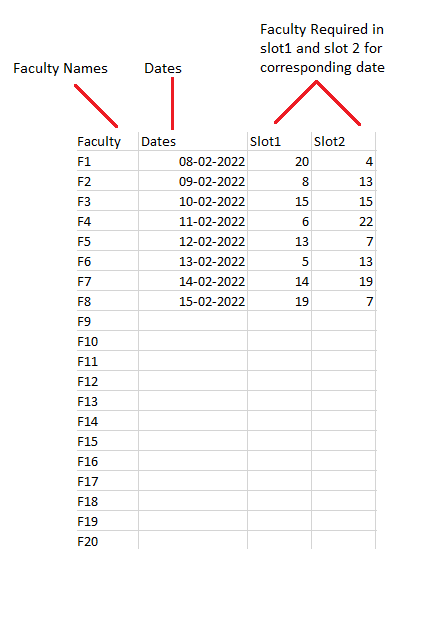
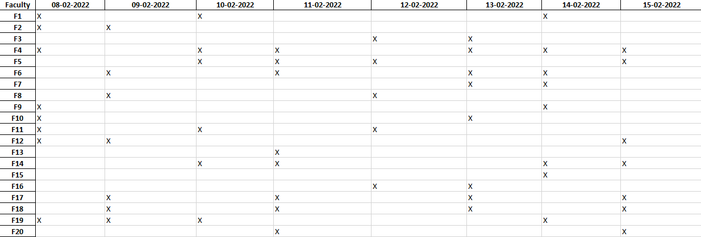

# 📝 Exam Supervision Assigner

This program is a simple GUI-based system to allocate different faculty to exam dates according to slots. The program randomly assigns a faculty to a particular slot with given constraints for reoccurrence.

## 🛠️ Technologies Used
- 
- 
- 

## 🚀 Steps to Use
1. **Download and Install**: [Download Here!!](https://cdn.yashashm.dev/artifacts/exam_supervision_assigner.exe)
2. **Run the Program**: Execute the main.exe to launch the program.
3. **Select Input File and Destination**: Choose the input file and the save destination.
4. **Press Calculate**: Initiate the calculation process.

Process Complete! 🎉

## 📋 Input File Format
**IMPORTANT!!**
Do not change the heading, including case and spelling.

## 📄 Output File Format

## 📖 [User Manual](https://cdn.yashashm.dev/artifacts/manual_exam_supervision_assigner.pdf)

## 🖼️ Screenshots of the Program

## 📜 License

